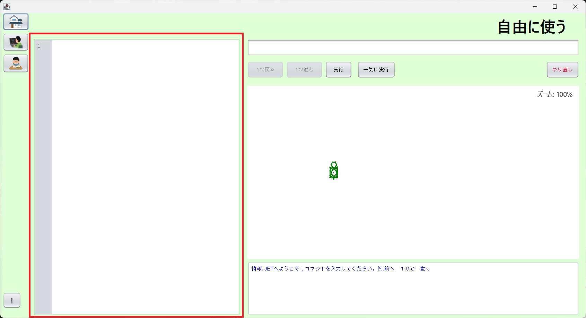
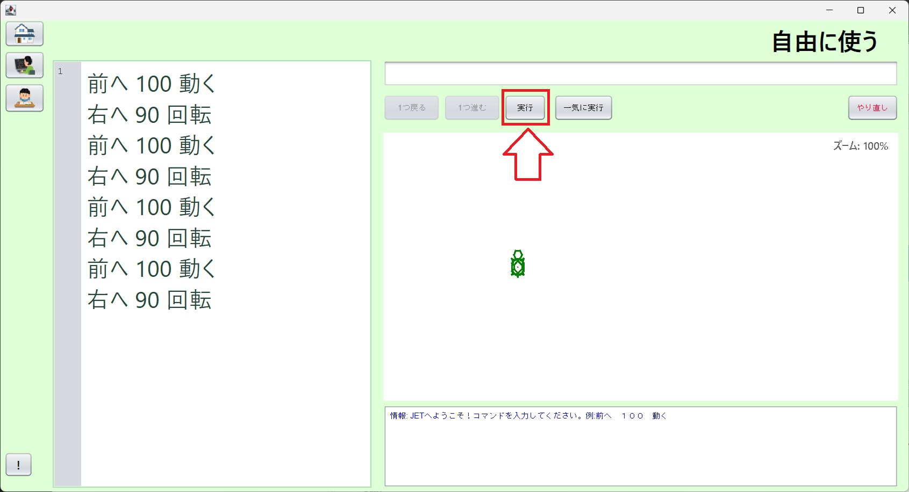
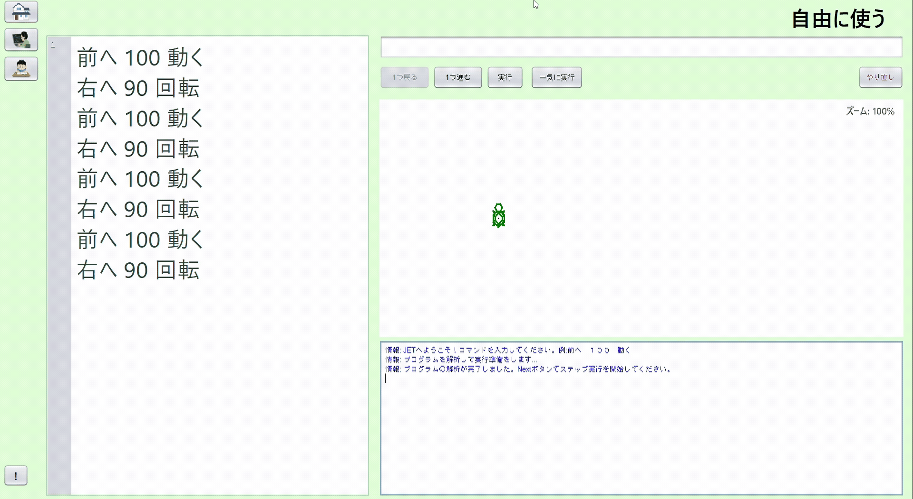

## JETを学ぼう！ ～🐢カメの動かし方～

「JET（ジェット）Learn System」へ ようこそ！
ここでは、画面のなかにいる「🐢カメ」に 命令（プログラム）を出して、いろんな図形や絵を描くことができます。
カメさんといっしょに、プログラミングの世界をたんけんしよう！

## 🎮 ２つのモード

* **🎓 JETを学習する**: 用意されたモンダイにちょうせんするモード。
* **🎨 自由に使う**: 自分のすきなように、自由に絵をかけるモード。

## 🐢 カメに命令を出そう！

図中、左側の赤で囲まれている所（テキストエリア）の中をクリックして、いろいろな命令を書いてみよう。




命令を描いたら、右上の実行ボタンをクリックしよう。命令が読み込まれ、実行できる状態になります。




隣の1つ進むボタンをクリックすると、命令が1つ実行されます。



### 👣 うごかす・まわす
* **`前へ 100 動く`** （まえへ 100 うごく）
  カメが 100歩 前にすすんで 線をひきます。


* **`後ろへ 100 動く`** （うしろへ 100 うごく）
  カメが うしろへ 100歩 さがって 線をひきます。
* **`右へ 90 回転`** （みぎへ 90 かいてん）
  カメが 右（みぎ）に 90度 むきをかえます。
* **`左へ 90 回転`** （ひだりへ 90 かいてん）
  カメが 左（ひだり）に 90度 むきをかえます。

### 🎨 いろをかえる・やりなおす
* **`色を 赤 に変える`** （いろを あか にかえる）
  カメさんが引く線の 色（いろ）をかえられます。
  * 使える色：`黒`、`赤`、`緑`、`黄色`、`青`、`白`
* **`初めへ`** （はじめへ）
  カメさんが、最初のばしょ・最初のむきに 帰ってきます。

### 🔁 まほうの めいれい（くりかえし）
おなじ 動きを 何回も させたいときは、このまほうを使おう！

* **`次を 4 回繰り返す [`**
  　**`前へ 50 動く`**
  　**`右へ 90 回転`**
  **`]`**
  「 `[` 」から「 `]` 」までのめいれいを、4回 くりかえしてくれます。

---

## 🔘 ボタンと マウスの つかいかた

めいれいを書いたら、ボタンをおして カメさんを動かそう！

* **▶️ 実行（じっこう）**: カメさんが アニメーションで かわいく動くよ。
* **⏩ 一気に実行（いっきにじっこう）**: カメさんが ワープしたみたいに、一瞬（いっしゅん）で絵をかいてくれるよ。
* **🐾 1つ進む / 1つ戻る**: カメさんが 1つのめいれいごとに 動いたり 戻ったりするよ。「どこでまちがえたかな？」と探すときにベンリ！
* **❌ やり直し（やりなおし）**: 赤いボタンをおすと、絵がぜんぶ消えて カメさんが まん中に戻るよ。

**【🖱️ マウスの ひみつワザ】**
* 画面のなかで **「マウスのコロコロ（ホイール）」** を回すと、絵を大きくしたり 小さくしたりできるよ！（ズーム機能）
* マウスを **「右クリック」** すると、ズームを元に直せるよ。
* 画面をドラッグ（クリックしたまま動かす）と、見ているばしょを 動かせるよ。

---

## 🌟 さいしょの ミッション

**【ミッション】四角（しかく）を かいてみよう！**

下のめいれいを書いて、「実行」ボタンをおしてみてね。
どんな形ができるかな？

```text
次を 4 回繰り返す [
  前へ 100 動く
  右へ 90 回転
]